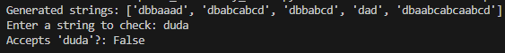
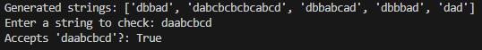

# RegularGrammars

### Course: Formal Languages & Finite Automata
### Author: Sava Luchian

----

## Theory
A context-free grammar (CFG) is a fundamental concept in formal language theory and computational linguistics. It provides a structured way to define the syntax of a language, enabling the generation of strings that conform to specific syntactic rules. A CFG consists of a set of non-terminal symbols, terminal symbols, production rules, and a designated start symbol. The non-terminal symbols serve as placeholders that can be replaced by sequences of terminals and other non-terminals according to the production rules. The terminal symbols, on the other hand, represent the actual characters or tokens that appear in the generated strings. The production rules define how non-terminals can be transformed into sequences of terminals and other non-terminals, dictating the structure of valid strings within the language. The process of string generation in a CFG begins with the start symbol and involves recursively applying production rules until only terminal symbols remain, forming a valid output string.

The significance of context-free grammars extends beyond theoretical applications, as they play a crucial role in the design of programming languages, natural language processing, and formal verification. Many programming languages are defined using CFGs because they provide a clear and unambiguous method for describing the syntax of constructs such as expressions, statements, and function definitions. By defining the syntax of a language formally, CFGs enable the development of parsers that can analyze and process code efficiently. In natural language processing, CFGs are used to model the grammatical structure of human languages, allowing for the development of syntactic parsers that can analyze sentences and generate parse trees. This is particularly useful in applications such as machine translation, speech recognition, and text analysis.

Another important aspect of formal language theory is the concept of finite automata (FA), which are abstract machines used to recognize patterns and process input strings based on predefined states and transitions. A finite automaton consists of a finite set of states, an input alphabet, a transition function that defines state changes based on input symbols, a designated start state, and a set of accepting states. Finite automata can be classified into two main types: deterministic finite automata (DFA) and non-deterministic finite automata (NFA). A DFA has exactly one transition for each state-symbol pair, ensuring a unique path for any given input string, whereas an NFA allows multiple possible transitions, providing greater flexibility in recognizing languages.

The relationship between context-free grammars and finite automata is particularly significant in the study of formal languages and automata theory. While regular languages, which are a subset of formal languages, can be recognized by finite automata, more complex languages that require nested or recursive structures often necessitate the use of pushdown automata (PDA), which extend finite automata by incorporating a stack for storing additional information. This enables pushdown automata to recognize context-free languages, making them a more powerful computational model than finite automata. The conversion of a CFG into an equivalent finite automaton, often through an intermediate step involving pushdown automata, is a critical technique in compiler design and formal verification, where language recognition and transformation play a fundamental role.

In practical applications, the process of transforming a context-free grammar into an equivalent finite automaton involves defining states that correspond to the non-terminals of the grammar, establishing transitions based on production rules, and identifying final states that signify successful recognition of valid strings. This transformation allows for the development of automated systems capable of verifying whether a given input string belongs to a language defined by a CFG. Such techniques are widely used in compilers, where lexical and syntax analysis phases involve recognizing tokens and parsing code structures based on formally defined grammars.

Moreover, the study of automata and formal grammars extends beyond programming languages and computational linguistics. These concepts are fundamental in areas such as artificial intelligence, where rule-based systems rely on structured representations of knowledge, and bioinformatics, where sequence analysis techniques utilize pattern recognition mechanisms similar to finite automata. Additionally, automata theory and formal grammars have applications in network security, where intrusion detection systems analyze network traffic using predefined patterns to identify potential threats.

In conclusion, context-free grammars and finite automata are essential theoretical constructs in computer science, forming the basis for numerous practical applications in programming languages, natural language processing, artificial intelligence, and formal verification. The ability to generate, analyze, and recognize structured patterns using formal grammars and automata enables the development of efficient algorithms for parsing, language processing, and pattern recognition. As computational systems continue to evolve, the principles of formal language theory and automata remain fundamental to advancing automation, artificial intelligence, and software development methodologies.


## Objectives:

* Create a class/type for the given grammar and generate 5 valid strings from it.
* Implement functionality to convert a grammar to a finite automaton.
* Add a method to check if a string can be generated via state transitions in the automaton.


## Implementation description

* The Grammar class stores non-terminals, terminals, and production rules, and provides methods for generating strings based on the grammar. The generate_string method replaces non-terminals with their production rules until only terminal symbols remain.

```
class Grammar:
    def __init__(self, VN, VT, P, start_symbol):
        self.VN = VN
        self.VT = VT
        self.P = P
        self.start_symbol = start_symbol

    def generate_string(self):
        current = self.start_symbol
        while any(symbol in self.VN for symbol in current):
            for symbol in current:
                if symbol in self.VN:
                    replacement = rand±om.choice(self.P[symbol])
                    current = current.replace(symbol, replacement, 1)
                    break
        return current
```

* The FiniteAutomaton class models a finite automaton with states, an alphabet, and transitions. It has an accepts method that checks if a given string can be processed by the automaton and accepted based on state transitions.

```
class FiniteAutomaton:
    def __init__(self, states, alphabet, transitions, start_state, final_states):
        self.states = states
        self.alphabet = alphabet
        self.transitions = transitions
        self.start_state = start_state
        self.final_states = final_states

    def accepts(self, input_string):
        current_state = self.start_state
        for symbol in input_string:
            if (current_state, symbol) in self.transitions:
                current_state = self.transitions[(current_state, symbol)][0]
            else:
                return False
        return current_state in self.final_states
```

* The to_finite_automaton method converts the grammar to a finite automaton. It creates states from non-terminals, and transitions are based on the production rules, with special handling for terminal symbols transitioning to accepting states.

```
def to_finite_automaton(self):
    states = set(self.VN) | {"q_accept"}
    alphabet = set(self.VT)
    transitions = {}
    start_state = self.start_symbol
    final_states = {"q_accept"}

    for non_terminal, productions in self.P.items():
        for production in productions:
            if len(production) == 1 and production in self.VT:
                transitions.setdefault((non_terminal, production), []).append("q_accept")
            else:
                transitions.setdefault((non_terminal, production[0]), []).append(production[1:])
    
    return FiniteAutomaton(states, alphabet, transitions, start_state, final_states)

```


## Conclusions / Screenshots / Results

In this project, we've created a system that takes a formal grammar and turns it into a finite automaton. The Grammar class lets us generate valid strings based on specific production rules, while the FiniteAutomaton class checks if those strings can be accepted by a series of state transitions. The to_finite_automaton method connects the two by converting the grammar into an automaton, allowing us to easily validate strings. This approach helps us better understand how formal languages work




## References

https://else.fcim.utm.md/pluginfile.php/110458/mod_resource/content/0/LFPC_Guide.pdf