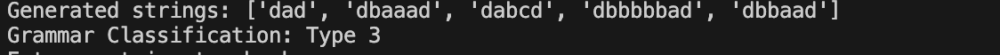

# FiniteAutomata

### Course: Formal Languages & Finite Automata
### Author: Sava Luchian

----

## Theory
Finite automata are one of the most fundamental models of computation, used to describe and analyze systems that process sequences of symbols. They are widely applied in various fields, including compiler design, text searching, and artificial intelligence. The concept of a finite automaton is based on a simple idea: a system that moves between a finite number of states based on given inputs. These state transitions follow predefined rules, which determine how the system reacts to different sequences of symbols.  

A finite automaton consists of a finite set of states and a set of rules that dictate how it moves between these states based on input symbols. It always starts in an initial state and processes an input string one symbol at a time, following transitions that lead it from one state to another. If, after processing the entire input, it reaches a designated final state, the input is considered accepted; otherwise, it is rejected. This ability to classify input sequences makes finite automata particularly useful in areas like pattern matching, lexical analysis, and network security.  

Finite automata can be classified into deterministic finite automata (DFA) and nondeterministic finite automata (NDFA). In a DFA, every state has exactly one transition for each possible input symbol, meaning that at any given moment, the system knows exactly what to do next. This determinism makes DFAs straightforward to implement and analyze, but it can sometimes make their construction more complex. On the other hand, an NDFA allows multiple possible transitions for the same input or even missing transitions, meaning that it does not always have a single, well-defined next step. Instead, it can be thought of as exploring multiple paths simultaneously. Although an NDFA might seem more powerful, it has been proven that any NDFA can be transformed into an equivalent DFA that recognizes the same language.  

Another key concept related to finite automata is their connection to regular grammars. A regular grammar is a formal set of production rules used to generate strings belonging to a specific language. Every finite automaton can be represented by an equivalent regular grammar and vice versa. In this way, finite automata provide a structural way to understand and process formal languages, while regular grammars offer a more abstract, rule-based perspective. This relationship is especially useful in programming languages, where regular grammars help define syntax rules, and finite automata assist in parsing and recognizing correct sequences of code.  

Since deterministic finite automata are easier to implement in practical applications, there are well-defined procedures for converting an NDFA into a DFA. The process involves creating new states that represent combinations of NDFA states and defining transitions based on these combined behaviors. While the resulting DFA may have more states than the original NDFA, it ensures that the system behaves in a predictable and efficient manner.  

Because finite automata operate through well-defined transitions, they can also be visualized graphically. A state diagram provides a clear representation of how an automaton processes input, with circles representing states and arrows indicating transitions between them. Initial states are marked with an entry arrow, while final states are often depicted using a double circle. These diagrams are particularly useful when designing or analyzing automata, as they allow for an intuitive understanding of how the system functions.  

The study of finite automata is essential in both theoretical and practical computer science. They provide the foundation for many areas, from language processing to hardware design. Their ability to recognize and generate structured sequences makes them invaluable tools in various computational tasks. Despite their simplicity, finite automata reveal deep insights into how information can be processed systematically and efficiently.


## Objectives:

* Provide a function in your grammar type/class that could classify the grammar based on Chomsky hierarchy.
* Implement a class to represent a finite automaton and generate its equivalent regular grammar.
* Develop functionality to determine whether the given finite automaton is deterministic or nondeterministic.
* Implement a method to convert a nondeterministic finite automaton (NDFA) into a deterministic finite automaton (DFA).
* Create a function to visualize the finite automaton as a state diagram.


## Implementation description

* The classify_grammar method iterates through the grammar's productions to classify the grammar type based on Chomsky's hierarchy. It checks if the productions follow patterns corresponding to Regular, Context-Free, Context-Sensitive, or Unrestricted grammars.

```
for non_terminal, productions in self.P.items():
    for production in productions:
        if len(production) == 1 and production in self.VT:
            continue
        elif len(production) == 2 and production[0] in self.VT and production[1] in self.VN:
            continue
        elif all(symbol in (self.VN | self.VT) for symbol in production):
            continue
        else:
            return "Type 0: Unrestricted Grammar"

```

* For each state, it checks all symbols in the alphabet and adds corresponding transition rules to the grammar. If the state is final, it adds an epsilon rule for termination.

```
for state in self.states:
    non_terminal = self.non_terminals[state]
    grammar[non_terminal] = []
    for symbol in self.alphabet:
        if (state, symbol) in self.transitions:
            next_state = self.transitions[(state, symbol)]
            next_non_terminal = self.non_terminals[next_state]
            grammar[non_terminal].append(f"{symbol}{next_non_terminal}")
    if state in self.final_states:
        grammar[non_terminal].append("ε")

```

* Here, the code loops through every state and checks the transitions for each symbol. If a state has multiple possible transitions for the same symbol, it returns False to indicate that the automaton is nondeterministic.

```
for state in self.states:
    for symbol in self.alphabet:
        transitions_for_symbol = [next_state for (s, sym), next_state in self.transitions.items() if s == state and sym == symbol]
        if len(transitions_for_symbol) != 1:
            return False

```

* In this part of the code, the method computes the next set of states for a given symbol by examining all the NDFA states in the current state set (state_list). The next_state_list contains all the possible transitions for those states.

```
next_state_list = []
for state in state_list:
    if (state, symbol) in self.transitions:
        next_state_list.append(self.transitions[(state, symbol)])

```

* This part of the code handles the creation of the state diagram. It assigns colors to the start state and final states, and connects the states using arrows that represent the transitions.

```
for state in self.states:
    if state == self.start_state:
        dot.node(state, shape='doublecircle', color='green')
    elif state in self.final_states:
        dot.node(state, shape='doublecircle', color='red')
    else:
        dot.node(state, shape='circle')

for (state, symbol), next_state in self.transitions.items():
    dot.edge(state, next_state, label=symbol)


```


## Conclusions / Screenshots / Results

In this project, I developed a system that takes a finite automaton and converts it into a regular grammar, checks whether the automaton is deterministic, and transforms a nondeterministic finite automaton (NDFA) into a deterministic one (DFA). The FiniteAutomatonToGrammar class allows me to generate a grammar based on the automaton's states and transitions, while the is_deterministic method helps me determine if the automaton is deterministic. The ndfa_to_dfa method allows me to convert an NDFA into a DFA for more efficient processing. Lastly, the generate_graph method provides a visual representation of the automaton, making it easier to understand. Overall, this project helped me explore the connections between automata, regular languages, and grammars, while also offering practical tools for working with finite automata.




## References

https://else.fcim.utm.md/pluginfile.php/110458/mod_resource/content/0/LFPC_Guide.pdf