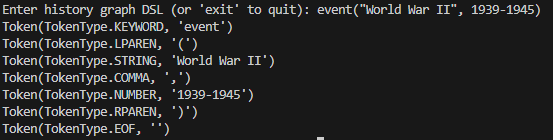
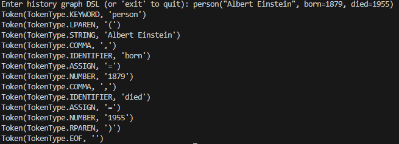
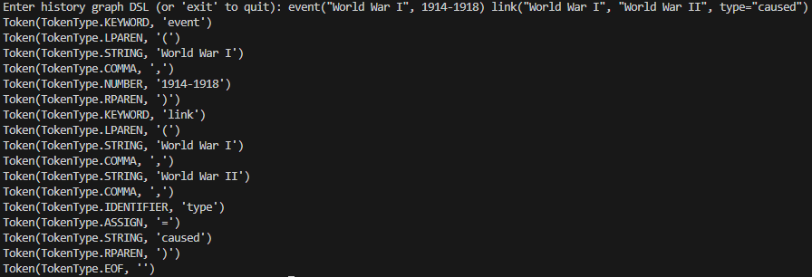

# Lexer & Scanner

### Course: Formal Languages & Finite Automata
### Author: Sava Luchian

----

## Theory
Lexical analysis is a fundamental process in language processing, where raw text is converted into meaningful components called tokens. This process is performed by a lexer, also known as a tokenizer or scanner. The lexer reads input character by character, groups them into recognizable units based on predefined patterns, and assigns them appropriate classifications. These tokens serve as the foundation for later stages in language interpretation, such as parsing and semantic analysis.  

A lexer plays a crucial role in language processing by ensuring that input is broken down into manageable and structured elements. Without a lexer, it would be difficult to systematically analyze and interpret text, as raw characters lack the structure needed for deeper processing. In the context of programming languages, compilers, interpreters, and domain-specific languages, lexical analysis is the first step in transforming human-readable code into a machine-understandable format.  

A domain-specific language is a specialized language designed for a specific application area, unlike general-purpose programming languages. DSLs provide a way to define and process structured information efficiently, often making complex tasks easier for domain experts. One example of a DSL is a history graph DSL, which is used to model historical events, figures, and relationships in a structured format. This allows users to input historical data in a way that can be parsed, analyzed, and visualized as a graph.  

A history graph DSL consists of structured commands that define historical entities such as events and people, their attributes such as dates and descriptions, and their relationships such as causal links or associations. To process this DSL, a lexer must recognize different elements, including keywords like event, person, and link, identifiers like names and attributes, numbers like years, and special symbols like parentheses and commas. Each of these elements corresponds to a different category of tokens, which the lexer extracts from the input.  

The core function of a lexer is to scan the input text and categorize substrings according to the rules of the language. This process involves identifying keywords, recognizing strings, extracting numerical values, distinguishing identifiers, handling punctuation and operators, and detecting errors. Keywords are reserved words that define structural elements of the DSL. Strings represent text enclosed in quotes, often used for names and descriptions. Numerical values represent years or other numeric data relevant to historical modeling. Identifiers include attribute names and variable-like elements. Punctuation and operators structure statements, such as the assignment operator, commas, and parentheses. Finally, the lexer must also detect and report errors when input does not conform to expected patterns.  

Lexical analysis is based on regular expressions, which define patterns for different token types. Regular expressions allow the lexer to efficiently match and classify input sequences. For example, a keyword like event is matched by a specific pattern, while numbers are matched using a different pattern. The lexer uses these patterns to systematically scan the input and generate a token stream that represents the structured elements of the DSL.  

Once lexical analysis is complete, the token stream is passed to the parsing stage, where higher-level structures are identified. Parsing involves analyzing token sequences to determine their grammatical correctness and construct a hierarchical representation of the input. In the case of a history graph DSL, parsing would involve interpreting how events and people are defined and how they are connected.  

One of the key challenges in lexical analysis is handling errors and ambiguities. If an input contains an unexpected character or an incorrectly formatted statement, the lexer must detect and report the issue. This ensures that invalid input is caught early, preventing errors from propagating to later stages of processing.  

Lexical analysis is essential in the development of custom languages. Whether for general-purpose programming languages, markup languages, or domain-specific languages like a history graph DSL, the lexer provides a structured way to extract meaning from raw text. By breaking input into tokens, it enables further processing, such as syntax analysis, semantic interpretation, and execution.  

In summary, lexical analysis is the first and most fundamental step in processing a structured language. A history graph DSL lexer plays a crucial role in transforming user input into a structured format that can be further analyzed and visualized. By defining clear rules for recognizing keywords, strings, numbers, and symbols, the lexer ensures that historical data can be effectively processed and represented. This enables the development of powerful tools for historical analysis, visualization, and simulation based on structured input data.


## Objectives:

* Implement a lexer for a custom History Graph DSL.
* Define and recognize keywords, strings, numbers, identifiers, and operators.
* Process input from the console and generate a stream of tokens.
* Identify and report lexical errors.
* Lay the groundwork for future parsing and graph generation based on the DSL.


## Implementation description

* The lexer processes input using **regular expressions** and classifies lexemes into the following token types:  

- `KEYWORD`: Reserved words (`event`, `person`, `link`).  
- `STRING`: Text enclosed in double quotes (`"World War II"`).  
- `NUMBER`: Year values (`1939`, `1969`).  
- `IDENTIFIER`: Attribute names (`born`, `died`, `type`).  
- `ASSIGN`: Assignment symbol (`=`).  
- `LPAREN`, `RPAREN`: Parentheses (`(`, `)`).  
- `COMMA`: Separator (`,`).  
- `EOF`: End of input.  

* The `Token` class represents a single token, storing its **type** and **value**. For each state, it checks all symbols in the alphabet and adds corresponding transition rules to the grammar. If the state is final, it adds an epsilon rule for termination.

```python
class Token:
    def __init__(self, type: TokenType, value: Union[str, int, float]):
        self.type = type
        self.value = value

    def __repr__(self):
        return f'Token({self.type}, {repr(self.value)})'
```  

* The lexer uses predefined **regular expressions** to match different token types:  

```python
token_specification = [
    ('KEYWORD',    r'\b(event|person|link)\b'),
    ('STRING',     r'"[^"]*"'),
    ('NUMBER',     r'\b\d{3,4}\b'),
    ('IDENTIFIER', r'\b[a-zA-Z_][a-zA-Z0-9_]*\b'),
    ('ASSIGN',     r'='),
    ('LPAREN',     r'\('),
    ('RPAREN',     r'\)'),
    ('COMMA',      r','),
    ('SKIP',       r'[ \t]+'),
    ('MISMATCH',   r'.'),
]
``` 
These patterns enable efficient **scanning and classification** of input text.  

* The lexer processes input in a sequential manner:  

```python
    tokens = []
    for match in compiled_regex.finditer(code):
        type = match.lastgroup
        value = match.group(type)
        if type == 'KEYWORD':
            tokens.append(Token(TokenType.KEYWORD, value))
        elif type == 'STRING':
            tokens.append(Token(TokenType.STRING, value.strip('"')))
        elif type == 'NUMBER':
            tokens.append(Token(TokenType.NUMBER, int(value)))
        elif type == 'IDENTIFIER':
            tokens.append(Token(TokenType.IDENTIFIER, value))
        elif type == 'ASSIGN':
            tokens.append(Token(TokenType.ASSIGN, value))
        elif type == 'LPAREN':
            tokens.append(Token(TokenType.LPAREN, value))
        elif type == 'RPAREN':
            tokens.append(Token(TokenType.RPAREN, value))
        elif type == 'COMMA':
            tokens.append(Token(TokenType.COMMA, value))
        elif type == 'SKIP':
            continue
        elif type == 'MISMATCH':
            raise RuntimeError(f'Unexpected character: {value}')
    tokens.append(Token(TokenType.EOF, ''))
    return tokens
```  
This function **iterates** through the input, matching tokens and appending them to a list. If an **unexpected character** is encountered, an error is raised.  

* The lexer reads **user input**, tokenizes it, and displays the **token stream**:  

```python
    while True:
        try:
            code = input("Enter history graph DSL (or 'exit' to quit): ").strip()
            if code.lower() == 'exit':
                break
            token_stream = lexer(code)
            for token in token_stream:
                print(token)
        except Exception as e:
            print(f"Error: {e}")
```  

This loop allows users to enter **history graph DSL commands**, receive **tokenized output**, and handle errors dynamically.


## Conclusions / Screenshots / Results
In this project, I developed a lexer for a history graph domain-specific language (DSL), enabling the structured processing of historical data. The lexer efficiently tokenizes input by recognizing keywords, identifiers, numerical values, and punctuation, laying the foundation for further analysis and visualization. This implementation highlighted the importance of lexical analysis in transforming raw text into a structured format for domain-specific applications. By creating the lexer, I gained a deeper understanding of language processing and its role in building more advanced systems for historical analysis and research.






## References

https://llvm.org/docs/tutorial/MyFirstLanguageFrontend/LangImpl01.html

https://en.wikipedia.org/wiki/Lexical_analysis
