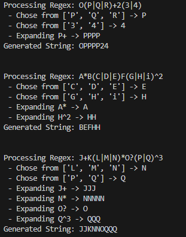
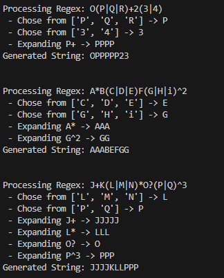

# Regular expressions

### Course: Formal Languages & Finite Automata
### Author: Sava Luchian

----

## Theory
The process of regular expression (regex) generation is a key technique in software development for pattern matching, text processing, and generating valid sequences of characters according to specific rules. Regular expressions are sequences of characters that form search patterns, primarily used for matching strings within texts. The task of dynamically generating valid combinations of symbols from a regular expression serves as an essential part of various applications such as text validation, data extraction, and even automated generation of syntactically correct strings based on predefined patterns.

A regular expression provides a means of specifying a set of strings, forming a pattern that can be matched against input text. These patterns can range from simple ones, like matching specific words or digits, to complex ones involving repetitions, alternatives, and nested structures. By defining these patterns using special syntax, regular expressions allow for the detection, manipulation, and generation of text based on very specific criteria.

In the context of the lab, the goal is to dynamically generate valid strings that match given regular expressions, without hardcoding the entire structure of the output. This requires an approach that interprets the regex, breaks it down into its components, and applies the appropriate logic to produce valid outputs. The challenge is to interpret a given regular expression and generate a result string by simulating the regex's rules and ensuring that the combinations adhere to those rules.

For instance, regular expressions often include symbols like +, *, ?, and {min,max}, which define the number of repetitions for a particular element. In this lab, a limitation was imposed, where any repetition was capped to a maximum of 5 times. This ensures that the generated strings do not become excessively long and impractical for analysis. Another important aspect is handling alternations such as (A|B|C), where the generated string should randomly choose between A, B, or C. Such random selections need to be executed while respecting the defined regex pattern.

This type of dynamic generation is essential in several practical applications. For example, in the field of data validation, a regex is often used to ensure that inputs like email addresses or phone numbers match a predefined format. However, it is equally important to generate test cases or valid inputs based on those same regex patterns. This ability to generate valid strings based on regex patterns can be applied to testing or automating tasks such as filling out forms or simulating user inputs for stress testing systems.

Additionally, regular expressions are an essential tool in lexical analysis, where raw text is broken down into its component parts (tokens) for further processing. Just like a lexer breaks down a language's syntax into tokens, dynamically generating valid strings based on a regex allows for the creation of various test cases or examples, which can then be validated, parsed, or processed in a downstream system.

This lab demonstrates an automated approach to interpreting regular expressions dynamically and generating valid strings that match the pattern. The generated strings serve as examples of valid inputs or as test data for applications that rely on regular expressions to parse or match text.

The key challenge in this lab is to systematically interpret the components of a regular expression, process repetitions (such as * or +), handle optional elements (such as ?), and manage alternations (such as (A|B|C)). All of these patterns must be respected during string generation to ensure that the output conforms to the given regex.

Furthermore, the lab incorporates a debug mode that provides insight into how the regular expression is being processed. This debugging feature is valuable because it allows the user to understand the sequence of operations that occur during regex evaluation, making it easier to track how each component of the regex contributes to the final output. This transparency helps in debugging and refining the regular expression processing logic, ensuring that the correct strings are generated.

In conclusion, the ability to generate valid strings based on regular expressions is a powerful technique for testing, validating, and simulating inputs in software systems. By interpreting the components of a regular expression and applying the appropriate logic, we can generate a wide variety of valid strings that conform to specific patterns. This process is fundamental to applications like data validation, text processing, and automated testing. The lab highlights the importance of dynamic regex interpretation and provides a practical approach to implementing such a system, enabling the generation of structured data that can be further analyzed or processed.


## Objectives:

* Implement a dynamic string generator based on regular expressions.
* Handle various regex components such as alternations, repetitions, and optional elements.
* Limit repetition counts in generated strings to a maximum of 5 times.
* Display a step-by-step sequence of operations during regex processing.
* Validate generated strings against the original regular expression patterns.


## Implementation description


* The string generator processes regular expressions dynamically and generates valid strings based on the given pattern:  

```markdown
- `+`: Repeats the preceding character one or more times.  
- `*`: Repeats the preceding character zero or more times.  
- `?`: Makes the preceding character optional (appears zero or one time).  
- `|`: Selects between alternative patterns.  
- `{min,max}`: Specifies a range for the number of repetitions.  
```
* The regex components are handled dynamically based on the pattern:
```python
def expand(pattern):
    if '|' in pattern:
        options = re.findall(r'\((.*?)\)', pattern)
        for option in options:
            choices = option.split('|')
            chosen = random.choice(choices)
            pattern = pattern.replace(f'({option})', chosen, 1)

    pattern = re.sub(r'(\w)\+', lambda m: m.group(1) * random.randint(1, max_repeats), pattern)
    pattern = re.sub(r'(\w)\*', lambda m: m.group(1) * random.randint(0, max_repeats), pattern)
    pattern = re.sub(r'(\w)\?', lambda m: m.group(1) if random.choice([True, False]) else '', pattern)
    pattern = re.sub(r'(\w)\^(\d+)', lambda m: m.group(1) * int(m.group(2)), pattern)

    return pattern
```  

This code interprets and expands regex components, applying random repetitions within defined limits, while handling alternations and optional elements.  

* The function also ensures that the repetitions are capped at a maximum of 5 times for performance reasons:

```python
    pattern = re.sub(r'(\w)\+', lambda m: m.group(1) * random.randint(1, 5), pattern)
    pattern = re.sub(r'(\w)\*', lambda m: m.group(1) * random.randint(0, 5), pattern)
    pattern = re.sub(r'(\w)\^(\d+)', lambda m: m.group(1) * min(int(m.group(2)), 5), pattern)
```  

This ensures the generated strings remain manageable and within a reasonable length.

* The process includes debugging and step-by-step tracing, showing how the regex is being interpreted and processed:

```python
steps.append(f"Expanding {m.group(1)}* -> {m.group(1) * random.randint(0, 5)}")
```

* Finally, the function validates that the generated string matches the original regex pattern:

```python
    result = expand(regex)
    if re.fullmatch(regex, result):
        return result, steps
    else:
        raise ValueError("Generated string does not match the regex pattern.")
```  

This ensures the generated output conforms to the expected structure defined by the regular expression.

* The string generator can handle multiple regex patterns and provide a valid string for each:

```python
for regex in regexes:
    result, steps = generate_from_regex(regex)
    for step in steps:
        print(" -", step)
    print(f"Generated String: {result}")
```

This loop processes each regular expression and generates valid strings accordingly, displaying the steps involved in generating the output.


## Conclusions / Screenshots / Results
In this project, I developed a dynamic string generator based on regular expressions, enabling the creation of valid strings by interpreting various regex components. The implementation efficiently processes patterns, handles alternations, repetitions, optional elements, and ensures string length limitations to avoid excessive outputs. This approach showcased the power of regular expressions in generating structured strings, emphasizing the flexibility and utility of regex in text processing tasks. By building this generator, I gained a deeper understanding of how regex can be dynamically interpreted and used for a wide range of applications, from input validation to automated testing. This project also provided valuable insights into handling the intricacies of regular expressions while ensuring valid, manageable outputs within the constraints defined by the original patterns.






## References

https://else.fcim.utm.md/pluginfile.php/110458/mod_resource/content/0/LFPC_Guide.pdf