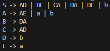

# Chomsky Normal Form

### Course: Formal Languages & Finite Automata
### Author: Sava Luchian

----

## Theory

The transformation of a Context-Free Grammar (CFG) into Chomsky Normal Form (CNF) is a foundational technique in the study of formal languages and automata theory. CNF is a standardized form of representing CFGs that significantly simplifies parsing algorithms, particularly the Cocke–Younger–Kasami (CYK) algorithm, which is widely used for syntactic analysis in compilers and natural language processing systems.

A CFG consists of a finite set of non-terminal symbols, terminal symbols, production rules, and a designated start symbol. These rules define how strings in a language can be generated. However, in many applications, the general form of CFGs is too flexible for algorithmic processing. CNF restricts the grammar to a simpler, more uniform format where each production rule is of one of the following types:

* $A \rightarrow BC$, where $A, B,$ and $C$ are non-terminal symbols (and $B, C \neq S$, unless for the start symbol),
* $A \rightarrow a$, where $a$ is a terminal symbol,
* $S \rightarrow \epsilon$, where $S$ is the start symbol and $\epsilon$ represents the empty string.

The purpose of converting a CFG into CNF is to prepare the grammar for parsing algorithms that require uniformity in rule structure. These algorithms depend on predictable rule patterns to efficiently determine whether a given string belongs to the language defined by the grammar. Without normalization, the variability in rule length and form would make such analysis infeasible or inefficient.

The transformation process involves several structured steps:

1. **Eliminating ε-productions**: These are rules that allow non-terminals to derive the empty string. To ensure correctness, all nullable non-terminals are identified, and new rules are generated to account for their possible omission in derivations.

2. **Eliminating unit productions**: These are rules where a non-terminal maps directly to another single non-terminal (e.g., $A \rightarrow B$). Such rules are removed by substituting them with the productions of the right-hand non-terminal.

3. **Removing inaccessible symbols**: Symbols that cannot be reached from the start symbol through any sequence of derivations are considered inaccessible and are removed to streamline the grammar.

4. **Replacing long productions**: In CNF, right-hand sides of rules must contain exactly two non-terminals or a single terminal. Long productions (e.g., $A \rightarrow BCD$) are broken down using new intermediate variables, preserving the original grammar's structure.

5. **Replacing terminals in mixed rules**: If a terminal appears in a rule alongside non-terminals (e.g., $A \rightarrow aB$), the terminal is replaced with a new non-terminal that maps solely to that terminal (e.g., $X_a \rightarrow a$, $A \rightarrow X_aB$).

Each of these transformations is carefully designed to maintain the language equivalence of the original CFG while ensuring the resulting grammar conforms strictly to CNF rules. This stepwise approach allows for precise tracking of how the grammar is altered and helps in verifying the correctness of the final structure.

This lab demonstrates the complete pipeline of converting a general CFG into CNF using a modular and maintainable implementation. Each transformation phase is encapsulated in separate functions, providing transparency and enabling debugging. The systematic design ensures that intermediate forms of the grammar can be inspected and verified before proceeding to the next transformation step.

Beyond theoretical significance, CNF conversion is also practically useful in compiler construction, natural language processing, formal verification, and automated reasoning systems. These domains often require efficient and deterministic parsing, which CNF greatly facilitates.

In conclusion, transforming a CFG into CNF is an essential preprocessing step for many language recognition and parsing algorithms. It simplifies the grammar without changing the language it defines and serves as a cornerstone in both theoretical and applied computer science. This lab provides a complete, step-by-step implementation of this transformation, illustrating not only the mechanics of CFG normalization but also the conceptual clarity it brings to the study and use of formal grammars.


## Objectives:

* Implement a converter that transforms any given Context-Free Grammar (CFG) into Chomsky Normal Form (CNF).
* Eliminate ε-productions (nullable rules) while preserving the language generated by the original CFG.
* Identify and remove unit productions to simplify grammar structure.
* Eliminate inaccessible and non-generating symbols to clean up the grammar.
* Replace productions with more than two non-terminals on the right-hand side using intermediate variables.
* Substitute terminals in mixed productions with dedicated non-terminal mappings.
* Preserve language equivalence throughout the transformation process.
* Display the intermediate forms of the grammar after each transformation step for debugging and verification.


## Implementation description

* The Chomsky Normal Form converter processes a given context-free grammar step by step, applying transformations to bring it into CNF:

```markdown
- ε-productions are removed by finding all nullable variables.  
- Unit productions are eliminated by replacing them with equivalent productions.  
- Non-generating and unreachable symbols are removed for grammar simplification.  
- Productions with more than two symbols are broken down using helper variables.  
- Terminal symbols in longer productions are replaced with new variables.  
```

* Nullable variables are identified, and ε-productions are removed by generating equivalent rules:

```python
nullable = {var for var, rules in grammar.items() if '' in rules}
for var in grammar:
    new_rules = set()
    for rule in grammar[var]:
        indices = [i for i, sym in enumerate(rule) if sym in nullable]
        for i in range(1, 2**len(indices)):
            rule_copy = list(rule)
            for bit, idx in enumerate(indices):
                if (i >> bit) & 1:
                    rule_copy[idx] = ''
            new_rules.add(tuple(sym for sym in rule_copy if sym))
    grammar[var] = {r for r in grammar[var] if r != ('',)} | new_rules
```

This removes ε-productions and generates new rules by omitting nullable symbols in all combinations.

* Unit productions (like `A → B`) are eliminated and replaced with the rules of the referenced variable:

```python
unit_productions = [(var, list(rules)[0]) for var, rules in grammar.items()
                    if all(len(r) == 1 and r[0].isupper() for r in rules)]
for var, target in unit_productions:
    if target in grammar:
        grammar[var].update(grammar[target])
    grammar[var] = {r for r in grammar[var] if not (len(r) == 1 and r[0].isupper())}
```

This step avoids infinite loops by replacing unit rules with equivalent productions from other variables.

* Productions longer than two symbols are split into binary rules using new helper variables:

```python
for var in grammar:
    new_rules = set()
    for rule in grammar[var]:
        while len(rule) > 2:
            new_var = f"X{counter}"
            counter += 1
            grammar[new_var] = {(rule[1], rule[2])}
            rule = (rule[0], new_var) + rule[3:]
        new_rules.add(rule)
    grammar[var] = new_rules
```

This ensures that all rules follow the CNF structure: either two non-terminals or one terminal.

* Terminals appearing in combination with non-terminals are replaced by new variables:

```python
for var in grammar:
    updated_rules = set()
    for rule in grammar[var]:
        new_rule = []
        for sym in rule:
            if len(sym) == 1 and sym.islower():
                if sym not in terminals_map:
                    terminals_map[sym] = f"T{counter}"
                    grammar[terminals_map[sym]] = {(sym,)}
                    counter += 1
                new_rule.append(terminals_map[sym])
            else:
                new_rule.append(sym)
        updated_rules.add(tuple(new_rule))
    grammar[var] = updated_rules
```

This final transformation ensures that terminal symbols only appear in single-terminal rules, as required by CNF.

* The resulting grammar is printed in its final CNF form:

```python
for var, rules in grammar.items():
    print(f"{var} → {' | '.join(''.join(r) for r in rules)}")
```

This provides a readable format of the CNF, verifying the correctness of the transformation.


## Conclusions / Screenshots / Results
In this project, I developed a converter that transforms any given context-free grammar into its equivalent Chomsky Normal Form (CNF). The implementation followed a structured and methodical approach to eliminate ε-productions, unit productions, non-generating and unreachable symbols, and to restructure rules into binary and terminal-only productions. This ensured that the final grammar strictly adheres to the CNF format, which is essential for parsing algorithms such as CYK and for theoretical analysis in formal language processing.
Throughout this implementation, I gained deeper insights into the complexity and logic required to manipulate grammars at a syntactic level. Each transformation step revealed how even minor rule adjustments can significantly impact the structure and expressiveness of a grammar. By developing this converter, I enhanced my understanding of grammar normalization techniques, which are crucial in compiler design, language recognition, and automated theorem proving. The final output provides a concise and CNF-compliant grammar, ready for use in further computational applications.





## References

https://else.fcim.utm.md/pluginfile.php/110458/mod_resource/content/0/LFPC_Guide.pdf