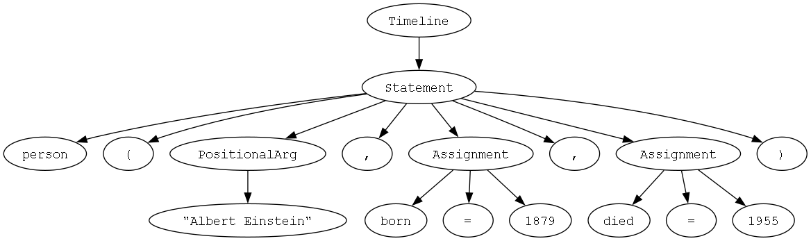
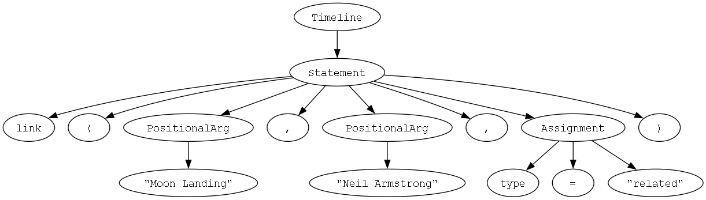
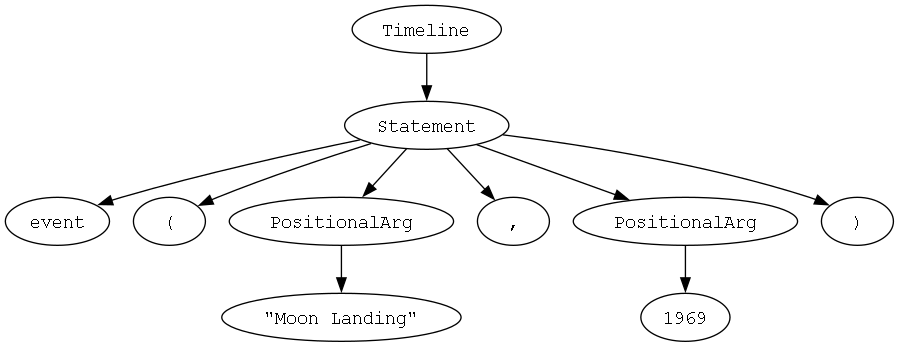

# Parser & Building an Abstract Syntax Tree

### Course: Formal Languages & Finite Automata
### Author: Sava Luchian

----


## Theory

Parsing is the process of analyzing a linear sequence of tokens (the output of lexical analysis) to determine its grammatical structure with respect to a formal grammar. In compiler design, interpreters, and many language-processing tools, parsing sits between tokenization and semantic analysis: it takes the flat token stream and organizes it into a hierarchical representation that reflects the nested, recursive nature of the language’s syntax.

### Context-Free Grammars and Parsers

Most programming and domain-specific languages are specified by a **context-free grammar (CFG)**. A CFG consists of:

* **Nonterminal symbols** (syntactic categories such as `<expression>`, `<statement>`, `<declaration>`)
* **Terminal symbols** (the basic tokens: identifiers, literals, keywords, operators)
* **Production rules** (how nonterminals expand into sequences of terminals and nonterminals)
* A **start symbol**, which denotes the top-level construct of the language.

A **parser** implements an algorithm to decide whether a given token sequence can be generated by the CFG and, if so, how. Two broad families of CFG parsers are:

1. **Top-Down Parsers**

   * Begin from the start symbol and attempt to rewrite it to match the input tokens.
   * **Recursive-descent parsers** are the simplest form: each nonterminal has a function that attempts to consume the corresponding tokens, calling other functions for nested nonterminals.
   * They are easy to implement by hand but generally require grammars without left recursion and with limited backtracking.

2. **Bottom-Up Parsers**

   * Begin from the input tokens and gradually reduce them to the start symbol by inverting production rules.
   * **LR parsers** (e.g., LALR, SLR) are table-driven and can handle a wider class of grammars automatically.
   * More complex to implement but more powerful and commonly used in production compilers.

### Concrete Parse Trees vs. Abstract Syntax Trees

* A **concrete parse tree** (or derivation tree) represents every detail of the grammar’s production rules, including all punctuation and ephemeral nodes introduced by the CFG.
* An **abstract syntax tree (AST)** distills that structure into the essential constructs of the language:

  * **Internal nodes** correspond to high-level constructs (expressions, statements, declarations).
  * **Leaf nodes** represent the intrinsic data (identifiers, literal values).
  * **Punctuation tokens** (parentheses, commas, semicolons) and intermediate nonterminals are typically omitted or collapsed.

The AST’s streamlined form makes subsequent phases—semantic analysis, optimization, code generation, or interpretation—more straightforward and less cluttered by syntactic sugar.

### Building the AST

When implementing a parser that constructs an AST:

1. **Design node types**
   Define a class or struct for each language construct, e.g.,

   * `BinaryExpression` with fields `operator`, `left`, `right`
   * `FunctionDeclaration` with fields `name`, `parameters`, `body`
   * `Literal` wrapping a primitive value

2. **Map grammar rules to node constructors**
   In a recursive-descent parser, each nonterminal-handling function:

   * Consumes the tokens matching that rule.
   * Creates the corresponding AST node, passing sub-nodes returned by deeper calls.

3. **Error handling and recovery**
   Robust parsers detect syntax errors, report meaningful messages (indicating expected vs. actual tokens), and often attempt to recover to find further errors in the same source.

4. **Annotation and attributes**
   AST nodes can carry additional information such as source locations (line and column numbers), symbol-table references, or interim semantic attributes for type checking.

### Applications of the AST

Once built, the AST serves as the unified representation for:

* **Semantic Analysis**: Type checking, scope resolution, and enforcement of language rules.
* **Transformations and Optimizations**: Rewriting the tree to simplify or optimize constructs before code generation.
* **Code Generation**: Emitting target code (machine code, bytecode, or another high-level language) by traversing the AST.
* **Static Analysis and Tooling**: Linters, formatters, refactoring tools, and IDE features rely on an AST to understand code structure.
* **Interpreters**: Directly evaluate the AST by recursively executing nodes without generating intermediate code.

In summary, parsing and AST construction convert raw token streams into a structured, semantically rich representation. This transformation underpins virtually all stages of language processing, from error checking to output generation, and is central to both theoretical language analysis and practical compiler or interpreter implementations.


## Objectives

* Understand the principles of parsing and abstract syntax trees.
* Define a `TokenType` enum and use regular expressions to implement a lexer for the timeline DSL.
* Design AST node classes (e.g. events, persons, links, assignments) to model the parsed structure.
* Build a simple recursive-descent parser that consumes tokens and constructs the AST.


## Implementation description

* The lexer iterates over the input with a single combined regex, classifies each match by `lastgroup`, and produces typed tokens:

```python
for match in compiled_regex.finditer(code):
    kind = match.lastgroup
    val  = match.group(kind)
```

* Token consumption is centralized in `eat()`, which checks the current token’s type, advances the position, and returns it, or raises on mismatch:

```python
if current.type == expected:
    pos += 1
    return token
raise RuntimeError(...)
```

* The top‐level parse loop builds a `Timeline` node by skipping inter-statement commas and delegating to `parse_statement()`:

```python
while current.type != EOF:
    if current.type == COMMA:
        eat(COMMA)
        continue
    root.add(parse_statement())
```

* A statement node records its keyword, parentheses, and a comma-separated list of assignments:

```python
stmt.add(PTNode(eat(KEYWORD).value))
stmt.add(PTNode(eat(LPAREN).value))
stmt.add(PTNode(eat(RPAREN).value))
```

* An assignment subtree captures identifier, equals sign, and literal (string or number):

```python
node.add(PTNode(eat(IDENTIFIER).value))
node.add(PTNode(eat(ASSIGN).value))
if current.type == STRING:
    node.add(PTNode(f'"{eat(STRING).value}"'))
else:
    node.add(PTNode(eat(NUMBER).value))
```

* The tree‐to‐Graphviz conversion visits each `PTNode`, creates a uniquely ID’d graph node with `label=node.name`, and links parent→child edges:

```python
dot.node(nid, label=node.name)
if parent:
    dot.edge(parent, nid)
for child in node.children:
    visit(child, nid)
```


## Conclusions / Screenshots / Results

In this project, I implemented a complete pipeline for parsing a domain-specific language (DSL) for historical timelines. Starting with a lexer that classifies input into token types using regular expressions, I then built a recursive-descent parser that constructs an abstract syntax tree (AST) based on the token stream. The AST reflects the hierarchical structure of the language, preserving every element of syntax including keywords, assignments, and values.
As a result, I developed a system that not only parses the input but also visualizes the resulting parse tree using Graphviz. This graphical output clearly demonstrates how the input is broken down and interpreted structurally. The process deepened my understanding of how syntactic structures are built and represented in compilers and interpreters.
Through this lab, I strengthened my grasp of parsing techniques, AST construction, and visualization. These concepts are foundational in language design and implementation, and the final output serves as a practical demonstration of the parsing process in action.







## References

https://else.fcim.utm.md/pluginfile.php/110458/mod_resource/content/0/LFPC_Guide.pdf